# Feature Matrix — Siêu Thị Mắt Kính CRM

> Audit date: 2026-02-24 · Repo: `/Volumes/Data - 3/sieuthimatkinhV1`

## Tổng quan Repo

| Layer | Count | Details |
|-------|-------|---------|
| **Prisma schemas** | 10 files | user, product, order, commission, shipping, inventory, partner, event, ai, main |
| **Admin pages** | 20 sections | customers, orders, products, shipping, warehouse, AI, analytics, automation, commissions, fraud, reviews, SEO, prescription, support, users, audit, partners, payouts, returns |
| **Shop pages** | 24 sections | cart, checkout, try-on, loyalty, referral, quiz, compare, wishlist, blog, booking, store, track, account, orders, search, support, about, faq, privacy, terms |
| **Partner portal** | 10 sections | dashboard, analytics, orders, content, links, wallet, notifications, store, toolkit, training |
| **API routes** | 18 groups | auth, AI, analytics, cart, checkout, coupon, growth, loyalty, orders, partner, products, ref, search, track, try-on, tryon, webhooks, admin |

---

## 🟢 CORE Features (bắt buộc luôn có)

| # | Feature | Admin Routes | Shop Routes | API | DB Tables |
|---|---------|-------------|-------------|-----|-----------|
| C1 | **Product Catalog** | `/admin/products` | `/(shop)/p/[slug]`, `/(shop)/c/[slug]`, `/(shop)/search` | `/api/products`, `/api/search` | `products`, `product_variants`, `product_media`, `collections`, `collection_products`, `lens_options` |
| C2 | **Cart & Checkout** | — | `/(shop)/cart`, `/(shop)/checkout` | `/api/cart`, `/api/checkout` | `carts`, `cart_items` |
| C3 | **Orders** | `/admin/orders` | `/(shop)/orders`, `/(shop)/track` | `/api/orders`, `/api/track` | `orders`, `order_items`, `order_status_history` |
| C4 | **Customer Management** | `/admin/customers`, `/admin/users` | `/(shop)/account` | `/api/auth`, `/api/admin` | `users`, `accounts`, `sessions`, `addresses`, `verification_tokens` |
| C5 | **Coupon / Discount** | (trong orders) | — | `/api/coupon` | `coupons`, `coupon_usages` |
| C6 | **Basic Analytics** | `/admin/page.tsx` (Dashboard) | — | `/api/analytics` | `event_logs` (subset) |
| C7 | **Auth & Roles** | `/admin/login` | `/(auth)` | `/api/auth` | `users` (role: ADMIN/STAFF/CUSTOMER) |
| C8 | **Static Pages** | — | `/(shop)/about`, `/faq`, `/terms`, `/privacy` | — | — |

---

## 🟡 ADVANCED Features (bật/tắt độc lập)

### ADV_SHIPPING — Multi-carrier Shipping

| Item | Detail |
|------|--------|
| **Description** | GHN, GHTK, ViettelPost, J&T, NinjaVan, VNPost, AhaMove integration |
| **Admin Routes** | `/admin/shipping` |
| **Shop Routes** | `/(shop)/track` (enhanced tracking) |
| **API** | `/api/webhooks` (carrier webhooks) |
| **DB Tables** | `carrier_configs`, `shipments`, `shipment_events` |
| **Dependencies** | Requires C3 (Orders) |
| **Impact if OFF** | Ẩn admin shipping page. Đơn hàng vẫn hoạt động nhưng tracking = manual. Hide carrier selection in checkout. |

---

### ADV_WAREHOUSE — Inventory & Warehouse Management

| Item | Detail |
|------|--------|
| **Description** | Multi-warehouse, vouchers (receipt/issue/adjust), stocktake, ledger |
| **Admin Routes** | `/admin/warehouse` |
| **API** | — (server-side logic) |
| **DB Tables** | `warehouses`, `inventory_vouchers`, `voucher_items`, `inventory_ledger`, `stocktakes`, `stocktake_items` |
| **Dependencies** | Requires C1 (Products — variant IDs) |
| **Impact if OFF** | Ẩn warehouse page. Tồn kho = field `stockQty` trên variant (đơn giản). Không có ledger audit trail. |

---

### ADV_PARTNER — Affiliate / Partner Portal

| Item | Detail |
|------|--------|
| **Description** | Partner signup, referral links, coupon attribution, multi-level (Affiliate/Agent/Leader) |
| **Admin Routes** | `/admin/partners`, `/admin/commissions`, `/admin/payouts`, `/admin/fraud` |
| **Shop Routes** | `/(shop)/referral` |
| **Partner Portal** | `/partner/*` (10 pages: dashboard, analytics, orders, content, links, wallet, notifications, store, toolkit, training) |
| **API** | `/api/partner`, `/api/ref` |
| **DB Tables** | `partner_profiles`, `attribution_sessions`, `order_referrals`, `commissions`, `commission_rules`, `partner_wallet_txs`, `payout_requests`, `partner_risk_signals` |
| **Dependencies** | Requires C3 (Orders), C5 (Coupons) |
| **Impact if OFF** | Ẩn toàn bộ partner portal. Ẩn admin partners/commissions/payouts/fraud. Ẩn referral link trên shop. API `/ref` trả 403. |

---

### ADV_RETURNS — Returns / RMA / Warranty

| Item | Detail |
|------|--------|
| **Description** | Đổi trả, đổi sản phẩm, bảo hành. Upload ảnh/video. Admin approval flow. |
| **Admin Routes** | `/admin/returns` |
| **Shop Routes** | (trong account/orders) |
| **API** | (trong `/api/orders`) |
| **DB Tables** | `return_requests` |
| **Dependencies** | Requires C3 (Orders) |
| **Impact if OFF** | Ẩn nút "Đổi trả/Bảo hành" trong order detail. Ẩn admin returns page. |

---

### ADV_REVIEWS — Reviews & Q&A

| Item | Detail |
|------|--------|
| **Description** | Đánh giá sản phẩm (rating + media), Q&A, spam detection, verified reviews |
| **Admin Routes** | `/admin/reviews` |
| **Shop Routes** | (trong product detail) |
| **API** | (trong `/api/products`) |
| **DB Tables** | `reviews`, `questions` |
| **Dependencies** | Requires C1 (Products) |
| **Impact if OFF** | Ẩn section reviews + Q&A trên product page. Ẩn admin reviews. |

---

### ADV_AI — AI Content Generation

| Item | Detail |
|------|--------|
| **Description** | Tạo mô tả sản phẩm bằng AI cho website/Facebook/TikTok/Zalo. Multiple tones. |
| **Admin Routes** | `/admin/ai` |
| **API** | `/api/ai` |
| **DB Tables** | `ai_content_logs` |
| **Dependencies** | Requires C1 (Products) |
| **Impact if OFF** | Ẩn nút "AI viết mô tả" trong product editor. Ẩn admin AI page. API `/api/ai` trả 403. |

---

### ADV_ANALYTICS — Advanced Analytics

| Item | Detail |
|------|--------|
| **Description** | Revenue analytics, customer cohorts, product performance, conversion funnels |
| **Admin Routes** | `/admin/analytics` |
| **API** | `/api/analytics` (advanced endpoints) |
| **DB Tables** | `event_logs`, `view_history` |
| **Dependencies** | Requires C6 (Basic Analytics) |
| **Impact if OFF** | Ẩn advanced analytics page. Dashboard basic vẫn có. |

---

### ADV_AUTOMATION — Marketing Automation

| Item | Detail |
|------|--------|
| **Description** | Scheduled tasks, email/SMS triggers, abandoned cart recovery |
| **Admin Routes** | `/admin/automation` |
| **API** | (server-side jobs) |
| **DB Tables** | — (uses event_logs) |
| **Dependencies** | Requires C3 (Orders), C4 (Customers) |
| **Impact if OFF** | Ẩn automation page. Không chạy scheduled jobs. |

---

### ADV_TRYON — Virtual Try-on (AR)

| Item | Detail |
|------|--------|
| **Description** | Thử kính ảo bằng camera (AR). Face detection + overlay. |
| **Admin Routes** | — |
| **Shop Routes** | `/(shop)/try-on` |
| **API** | `/api/try-on`, `/api/tryon` |
| **DB Tables** | — |
| **Dependencies** | Requires C1 (Products — media/images) |
| **Impact if OFF** | Ẩn nút "Thử kính" trên product page. Ẩn `/try-on` route. |

---

### ADV_LOYALTY — Loyalty & Points

| Item | Detail |
|------|--------|
| **Description** | Tích điểm, đổi thưởng, membership tiers |
| **Shop Routes** | `/(shop)/loyalty` |
| **API** | `/api/loyalty` |
| **DB Tables** | — (TBD or embedded in user) |
| **Dependencies** | Requires C3 (Orders), C4 (Customers) |
| **Impact if OFF** | Ẩn loyalty page. Không tích điểm khi mua hàng. |

---

### ADV_PRESCRIPTION — Prescription Management

| Item | Detail |
|------|--------|
| **Description** | Nhập đơn thuốc mắt (SPH/CYL/AXIS/PD), upload ảnh đơn, gắn vào order |
| **Admin Routes** | `/admin/prescription` |
| **Shop Routes** | (trong checkout/order flow) |
| **API** | (trong `/api/checkout`) |
| **DB Tables** | `order_items.prescription`, `order_items.prescriptionImage` |
| **Dependencies** | Requires C2 (Checkout), C3 (Orders) |
| **Impact if OFF** | Ẩn prescription form trong checkout. Không cho upload đơn thuốc. |

---

### ADV_SEO — SEO Tools

| Item | Detail |
|------|--------|
| **Description** | Meta tags editor, sitemap, robots.txt, structured data |
| **Admin Routes** | `/admin/seo` |
| **Shop Routes** | `/robots.ts`, `/sitemap.ts` |
| **API** | — |
| **DB Tables** | `products.metaTitle`, `products.metaDesc` |
| **Dependencies** | Requires C1 (Products) |
| **Impact if OFF** | Admin SEO page ẩn. Sitemap/robots vẫn hoạt động (auto-generated). |

---

### ADV_SUPPORT — Customer Support / Tickets

| Item | Detail |
|------|--------|
| **Description** | Ticket system, FAQ management, live chat |
| **Admin Routes** | `/admin/support` |
| **Shop Routes** | `/(shop)/support` |
| **API** | — |
| **DB Tables** | — (TBD) |
| **Dependencies** | Requires C4 (Customers) |
| **Impact if OFF** | Ẩn support page. Ẩn chat widget. |

---

### ADV_SHOP_EXTRAS — Shop Extra Pages

| Item | Detail |
|------|--------|
| **Description** | Wishlist, Compare, Quiz (tìm kính phù hợp), Blog, Booking, Bundle |
| **Shop Routes** | `/(shop)/wishlist`, `/(shop)/compare`, `/(shop)/quiz`, `/(shop)/blog`, `/(shop)/booking`, `/(shop)/bundle` |
| **API** | — |
| **DB Tables** | `wishlist_items` |
| **Dependencies** | Requires C1 (Products) |
| **Impact if OFF** | Ẩn các trang tương ứng. Ẩn nút wishlist/compare trên product cards. |

---

## Dependency Graph

```mermaid
graph TD
    C1[C1: Products] --> ADV_REVIEWS[ADV_REVIEWS]
    C1 --> ADV_AI[ADV_AI]
    C1 --> ADV_TRYON[ADV_TRYON]
    C1 --> ADV_SEO[ADV_SEO]
    C1 --> ADV_WAREHOUSE[ADV_WAREHOUSE]
    C1 --> ADV_SHOP_EXTRAS[ADV_SHOP_EXTRAS]
    
    C2[C2: Cart/Checkout] --> ADV_PRESCRIPTION[ADV_PRESCRIPTION]
    
    C3[C3: Orders] --> ADV_SHIPPING[ADV_SHIPPING]
    C3 --> ADV_RETURNS[ADV_RETURNS]
    C3 --> ADV_PARTNER[ADV_PARTNER]
    C3 --> ADV_AUTOMATION[ADV_AUTOMATION]
    C3 --> ADV_LOYALTY[ADV_LOYALTY]
    
    C4[C4: Customers] --> ADV_AUTOMATION
    C4 --> ADV_LOYALTY
    C4 --> ADV_SUPPORT[ADV_SUPPORT]
    
    C5[C5: Coupons] --> ADV_PARTNER
    
    C6[C6: Basic Analytics] --> ADV_ANALYTICS[ADV_ANALYTICS]

    style C1 fill:#22c55e,color:#fff
    style C2 fill:#22c55e,color:#fff
    style C3 fill:#22c55e,color:#fff
    style C4 fill:#22c55e,color:#fff
    style C5 fill:#22c55e,color:#fff
    style C6 fill:#22c55e,color:#fff

    style ADV_SHIPPING fill:#eab308,color:#000
    style ADV_WAREHOUSE fill:#eab308,color:#000
    style ADV_PARTNER fill:#eab308,color:#000
    style ADV_RETURNS fill:#eab308,color:#000
    style ADV_REVIEWS fill:#eab308,color:#000
    style ADV_AI fill:#eab308,color:#000
    style ADV_ANALYTICS fill:#eab308,color:#000
    style ADV_AUTOMATION fill:#eab308,color:#000
    style ADV_TRYON fill:#eab308,color:#000
    style ADV_LOYALTY fill:#eab308,color:#000
    style ADV_PRESCRIPTION fill:#eab308,color:#000
    style ADV_SEO fill:#eab308,color:#000
    style ADV_SUPPORT fill:#eab308,color:#000
    style ADV_SHOP_EXTRAS fill:#eab308,color:#000
```

---

## Feature Keys (chuẩn hoá)

| Key | Feature | Suggested Pricing Model |
|-----|---------|------------------------|
| `ADV_SHIPPING` | Multi-carrier Shipping | Subscription |
| `ADV_WAREHOUSE` | Inventory & Warehouse | Subscription |
| `ADV_PARTNER` | Affiliate / Partner Portal | Subscription |
| `ADV_RETURNS` | Returns / RMA / Warranty | Subscription |
| `ADV_REVIEWS` | Reviews & Q&A | Subscription |
| `ADV_AI` | AI Content Generation | PAYG |
| `ADV_ANALYTICS` | Advanced Analytics | Subscription |
| `ADV_AUTOMATION` | Marketing Automation | Subscription |
| `ADV_TRYON` | Virtual Try-on (AR) | Subscription / PAYG |
| `ADV_LOYALTY` | Loyalty & Points | Subscription |
| `ADV_PRESCRIPTION` | Prescription Management | Subscription |
| `ADV_SEO` | SEO Tools | One-time |
| `ADV_SUPPORT` | Customer Support / Tickets | Subscription |
| `ADV_SHOP_EXTRAS` | Shop Extras (Wishlist, Compare, Quiz, Blog, Booking, Bundle) | Subscription |
